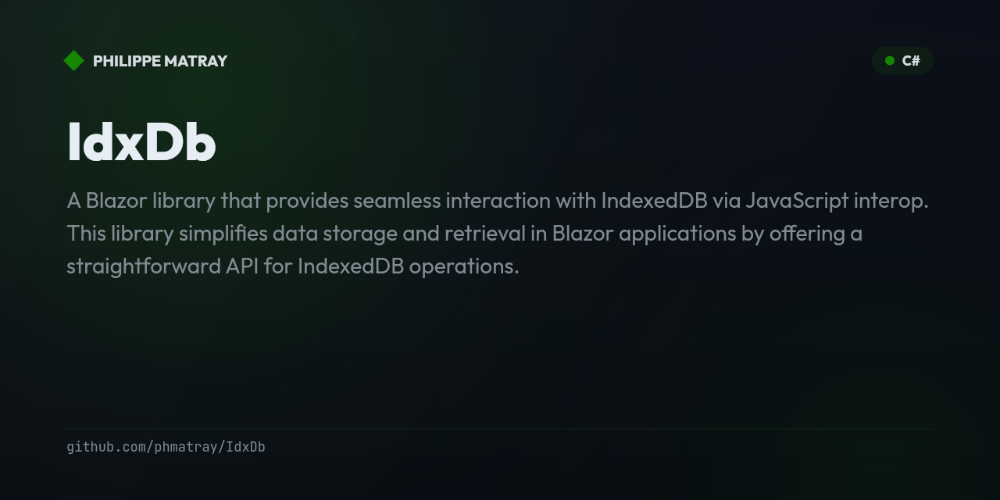

# **IdxDb**

A Blazor library that provides seamless interaction with **IndexedDB** via JavaScript interop. This library simplifies data storage and retrieval in Blazor applications by offering a straightforward API for IndexedDB operations.

 

## **Table of Contents**

- [Features](#features)
- [Installation](#installation)
- [Getting Started](#getting-started)
    - [Database Initialization](#database-initialization)
    - [Using IndexedDbInterop](#using-indexeddbinterop)
    - [Using LINQ API](#using-linq-api)
- [API Reference](#api-reference)
    - [IndexedDbInterop](#indexeddbinterop)
    - [LINQ API](#linq-api)
- [Examples](#examples)
    - [CRUD Operations](#crud-operations)
    - [Filtering by Index](#filtering-by-index)
    - [Counting Records](#counting-records)
    - [Clearing the Object Store](#clearing-the-object-store)
- [Demo Application](#demo-application)
- [Contributing](#contributing)
- [License](#license)
- [Acknowledgments](#acknowledgments)

---

## **Features**

- **Easy Setup**: Simplify the configuration and use of IndexedDB in Blazor applications.
- **Type Safety**: Utilize generics for strong typing and compile-time checks.
- **LINQ Support**: Query IndexedDB using familiar LINQ syntax similar to Entity Framework Core.
- **Async Operations**: All methods are asynchronous, providing non-blocking data operations.
- **Transactions Support**: Execute multiple operations within a single transaction.
- **Indexing**: Create and query indexes for efficient data retrieval.
- **Schema Migration**: Upgrade database schemas with versioning and store schemas.
- **Comprehensive API**: Provides methods for CRUD operations, filtering, counting, and clearing data.

## **Installation**

Install the package via NuGet Package Manager:

```bash
dotnet add package IdxDb --version 1.0.0-beta.1
```

Or via the NuGet Package Manager UI in Visual Studio by searching for **IndexedDb**.

## **Getting Started**

### **Database Initialization**

Before using the library, you need to define your database schema and initialize it. This is typically done in the `OnInitializedAsync` method of your Blazor component or in the startup configuration.

```csharp
@page "/"
@using IndexedDb
@using IndexedDb.BlazorApp.Services
@inject IndexedDbInterop IndexedDbInterop

<PageTitle>Home</PageTitle>

<h1>IndexedDB Demo</h1>

<!-- Your UI Components Here -->

@code {
    private IndexedDbRepository<Person> _personRepository;

    protected override async Task OnInitializedAsync()
    {
        // Initialize IndexedDbInterop
        _personRepository = new IndexedDbRepository<Person>(IndexedDbInterop, "demo", "persons");

        // Define the store schema with indexes
        var storeSchemas = new[]
        {
            new
            {
                name = "persons",
                options = new { keyPath = "id", autoIncrement = false },
                indexes = new[]
                {
                    new { name = "ageIndex", keyPath = "age", unique = false }
                }
            }
        };

        // Upgrade or initialize the database
        await _personRepository.UpgradeDatabaseAsync("demo", 1, storeSchemas);

        // Retrieve all persons
        await RetrieveAllPersonsAsync();
    }

    public async ValueTask DisposeAsync()
    {
        if (_personRepository != null)
        {
            await _personRepository.DisposeAsync();
        }
    }

    // Other methods will be detailed in the "Using IndexedDbInterop" section
}
```

### **Using IndexedDbInterop**

The `IndexedDbInterop` class provides direct methods to interact with IndexedDB. For higher-level operations, the `IndexedDbRepository<TItem>` class offers a more convenient API.

1. **Register Services in DI Container**

   Ensure that `IndexedDbInterop` is registered in your dependency injection (DI) container. Typically, this is done in the `Program.cs` or `Startup.cs` file.

   ```csharp
   builder.Services.AddScoped<IndexedDbInterop>();
   builder.Services.AddScoped(typeof(IndexedDbRepository<>));
   ```

2. **Inject the Repository into Your Component**

   ```csharp
   @inject IndexedDbRepository<Person> PersonRepository
   ```

3. **Initialize the Database and Perform Operations**

   Here's an example of how to add, retrieve, update, delete, filter, count, and clear records using the `IndexedDbRepository`.

   ```csharp
   @page "/"
   @using IndexedDb
   @using IndexedDb.BlazorApp.Models
   @using IndexedDb.BlazorApp.Services
   @inject IndexedDbRepository<Person> PersonRepository
   @inject IJSRuntime JsRuntime

   <PageTitle>Home</PageTitle>

   <h1>IndexedDB Demo</h1>

   <!-- Your UI Components Here -->

   @code {
       // Component code as shown in the [Database Initialization] section
   }
   ```

### **Using LINQ API**

The library now includes a LINQ-like API that provides a familiar, Entity Framework Core-style syntax for querying IndexedDB.

1. **Initialize IndexedDbContext**

   ```csharp
   @using IdxDb
   @inject IJSRuntime JSRuntime

   @code {
       private IndexedDbContext? _context;
       private IIndexedDbSet<Product>? _products;

       protected override async Task OnInitializedAsync()
       {
           // Create context
           _context = new IndexedDbContext(JSRuntime, "MyDatabase");
           
           // Initialize with entity types
           await _context.InitializeAsync(typeof(Product), typeof(Customer));
           
           // Get entity sets
           _products = _context.Set<Product>();
       }
   }
   ```

2. **Define Entity Classes**

   ```csharp
   public class Product
   {
       [IndexedDbKeyPath(AutoIncrement = true)]
       public int Id { get; set; }
       
       public required string Name { get; set; }
       public decimal Price { get; set; }
       public int Stock { get; set; }
       public bool IsActive { get; set; }
   }
   ```

3. **Perform LINQ Queries**

   ```csharp
   // Basic queries
   var allProducts = await _products.ToArrayAsync();
   var activeProducts = await _products.Where(p => p.IsActive).ToArrayAsync();
   
   // Filtering with multiple conditions
   var expensiveProducts = await _products
       .Where(p => p.Price > 100 && p.Stock > 0)
       .ToArrayAsync();
   
   // Ordering
   var sortedByPrice = await _products
       .OrderBy(p => p.Price)
       .ToArrayAsync();
   
   var sortedByNameDesc = await _products
       .OrderByDescending(p => p.Name)
       .ToArrayAsync();
   
   // Pagination
   var pagedResults = await _products
       .OrderBy(p => p.Name)
       .Skip(20)
       .Take(10)
       .ToArrayAsync();
   
   // First/Single operations
   var firstProduct = await _products.FirstAsync();
   var firstExpensive = await _products.FirstAsync(p => p.Price > 1000);
   var singleProduct = await _products.SingleAsync(p => p.Id == 5);
   
   // Aggregations
   var totalCount = await _products.CountAsync();
   var expensiveCount = await _products.CountAsync(p => p.Price > 100);
   var hasAnyActive = await _products.AnyAsync(p => p.IsActive);
   
   // Complex queries
   var complexQuery = await _products
       .Where(p => p.IsActive && p.Stock > 0)
       .OrderByDescending(p => p.Price)
       .Skip(10)
       .Take(5)
       .ToArrayAsync();
   ```

4. **CRUD Operations**

   ```csharp
   // Add single entity
   var newProduct = new Product { Name = "Laptop", Price = 999.99m, Stock = 10, IsActive = true };
   await _products.AddAsync(newProduct);
   
   // Add multiple entities
   var products = new[] { product1, product2, product3 };
   await _products.AddRangeAsync(products);
   
   // Update entity
   product.Price = 899.99m;
   await _products.UpdateAsync(product);
   
   // Delete entity
   await _products.DeleteAsync(product);
   // Or by key
   await _products.DeleteAsync(productId);
   
   // Find by key
   var product = await _products.FindAsync(5);
   
   // Clear all entities
   await _products.ClearAsync();
   ```

5. **Limitations and Notes**

   - **Select Projections**: Currently, Select operations that change the entity type are not supported directly. Use `ToArrayAsync()` first, then apply Select in memory:
     ```csharp
     var products = await _products.ToArrayAsync();
     var projections = products.Select(p => new { p.Name, p.Price }).ToArray();
     ```
   
   - **Joins**: Join operations between different entity types are not yet supported.
   
   - **Expression Limitations**: Complex expressions involving method calls on entity properties may not be supported. Keep Where clauses simple for best compatibility.
   
   - **Performance**: All queries currently fetch all data and apply filters in memory. Future versions may optimize this for better performance with large datasets.

## **API Reference**

### **IndexedDbInterop**

The `IndexedDbInterop` class provides methods to interact directly with IndexedDB.

#### **Methods**

- `AddOneAsync(string dbName, string storeName, object item)`
- `AddManyAsync(string dbName, string storeName, object[] items)`
- `GetAllAsync<T>(string dbName, string storeName)`
- `GetOneAsync<TRecord, TKey>(string dbName, string storeName, TKey id)`
- `UpdateOneAsync(string dbName, string storeName, object item)`
- `DeleteOneAsync<TKey>(string dbName, string storeName, TKey id)`
- `UpgradeDatabaseAsync(string dbName, int newVersion, object[] storeSchemas)`
- `CreateIndexAsync(string dbName, string storeName, string indexName, string keyPath, bool unique = false)`
- `GetAllByIndexAsync<T>(string dbName, string storeName, string indexName, object query)`
- `ExecuteTransactionAsync(string dbName, string[] storeNames, string mode, Func<Task> transactionBody)`
- `CountAsync(string dbName, string storeName)`
- `ClearStoreAsync(string dbName, string storeName)`
- `DisposeAsync()`

### **IndexedDbRepository\<TItem>**

The `IndexedDbRepository<TItem>` class simplifies data operations by setting the database name, store name, and item type.

#### **Constructor**

```csharp
public IndexedDbRepository(IndexedDbInterop indexedDbInterop, string dbName, string storeName)
```

#### **Methods**

- `AddOneAsync(TItem item)`
- `AddManyAsync(TItem[] items)`
- `GetAllAsync()`
- `GetOneAsync<TKey>(TKey id)`
- `UpdateOneAsync(TItem item)`
- `DeleteOneAsync<TKey>(TKey id)`
- `GetAllByIndexAsync<TIndex>(string indexName, object query)`
- `CountAsync()`
- `ClearStoreAsync()`
- `UpgradeDatabaseAsync(string dbName, int newVersion, object[] storeSchemas)`
- `DisposeAsync()`

### **LINQ API**

The LINQ API provides a familiar, Entity Framework Core-style interface for IndexedDB operations.

#### **IndexedDbContext**

The main entry point for LINQ operations, similar to EF Core's DbContext.

```csharp
public class IndexedDbContext : IAsyncDisposable
{
    public IndexedDbContext(IJSRuntime jsRuntime, string databaseName);
    public IIndexedDbSet<TEntity> Set<TEntity>() where TEntity : class;
    public Task InitializeAsync(params Type[] entityTypes);
    public ValueTask DisposeAsync();
}
```

#### **IIndexedDbSet\<TEntity>**

Represents a queryable collection of entities from an IndexedDB object store.

```csharp
public interface IIndexedDbSet<TEntity> : IQueryable<TEntity>
{
    // CRUD Operations
    Task AddAsync(TEntity entity);
    Task AddRangeAsync(IEnumerable<TEntity> entities);
    Task UpdateAsync(TEntity entity);
    Task DeleteAsync(TEntity entity);
    Task DeleteAsync<TKey>(TKey key);
    Task<TEntity?> FindAsync<TKey>(TKey key);
    Task ClearAsync();
    
    // Query Execution
    Task<TEntity[]> ToArrayAsync();
    Task<List<TEntity>> ToListAsync();
    Task<TEntity> FirstAsync();
    Task<TEntity> FirstAsync(Expression<Func<TEntity, bool>> predicate);
    Task<TEntity?> FirstOrDefaultAsync();
    Task<TEntity?> FirstOrDefaultAsync(Expression<Func<TEntity, bool>> predicate);
    Task<TEntity> SingleAsync();
    Task<TEntity> SingleAsync(Expression<Func<TEntity, bool>> predicate);
    Task<TEntity?> SingleOrDefaultAsync();
    Task<TEntity?> SingleOrDefaultAsync(Expression<Func<TEntity, bool>> predicate);
    Task<int> CountAsync();
    Task<int> CountAsync(Expression<Func<TEntity, bool>> predicate);
    Task<bool> AnyAsync();
    Task<bool> AnyAsync(Expression<Func<TEntity, bool>> predicate);
}
```

#### **Supported LINQ Methods**

- `Where` - Filter entities based on conditions
- `OrderBy` / `OrderByDescending` - Sort results
- `Skip` / `Take` - Implement pagination
- `First` / `FirstOrDefault` - Get first element
- `Single` / `SingleOrDefault` - Get single element
- `Count` - Count entities
- `Any` - Check if any entities exist

## **Examples**

### **CRUD Operations**

#### **Adding a Person**

```csharp
private async Task AddPersonAsync()
{
    if (string.IsNullOrWhiteSpace(_editPerson.Name))
    {
        _message = "Name is required.";
        return;
    }

    if (_editPerson.Age <= 0)
    {
        _message = "Age must be a positive number.";
        return;
    }

    try
    {
        // Create a new person
        var personToAdd = new Person
        {
            Id = Guid.NewGuid(),
            Name = _editPerson.Name,
            Age = _editPerson.Age
        };

        // Add the person to the database
        await _personRepository.AddOneAsync(personToAdd);

        // Update the list of people
        _people = _people.Append(personToAdd).ToArray();

        // Clear the form
        _editPerson = new Person();

        _message = "Person added successfully.";
    }
    catch (Exception ex)
    {
        _message = $"Error adding person: {ex.Message}";
    }
}
```

#### **Retrieving All People**

```csharp
private async Task RetrieveAllPeopleAsync()
{
    try
    {
        _people = await _personRepository.GetAllAsync();
        _message = "People retrieved successfully.";
    }
    catch (Exception ex)
    {
        _message = $"Error retrieving people: {ex.Message}";
    }
}
```

#### **Updating a Person**

```csharp
private async Task UpdatePersonAsync()
{
    if (string.IsNullOrWhiteSpace(_editPerson.Name))
    {
        _message = "Name is required.";
        return;
    }

    if (_editPerson.Age <= 0)
    {
        _message = "Age must be a positive number.";
        return;
    }

    try
    {
        // Update the person in the database
        await _personRepository.UpdateOneAsync(_editPerson);

        // Update the local list
        var index = Array.FindIndex(_people, p => p.Id == _editPerson.Id);
        if (index != -1)
        {
            _people[index] = _editPerson;
        }

        // Clear the edit form
        _editPerson = new Person();

        _message = "Person updated successfully.";
    }
    catch (Exception ex)
    {
        _message = $"Error updating person: {ex.Message}";
    }
}
```

#### **Deleting a Person**

```csharp
private async Task DeletePersonAsync(Guid id)
{
    try
    {
        // Delete the person from the database
        await _personRepository.DeleteOneAsync(id);

        // Remove from the local list
        _people = _people.Where(p => p.Id != id).ToArray();

        _message = "Person deleted successfully.";
    }
    catch (Exception ex)
    {
        _message = $"Error deleting person: {ex.Message}";
    }
}
```

### **Filtering by Index**

Retrieve all people of a certain age using the `ageIndex`.

```csharp
private async Task FilterPeopleByAgeAsync()
{
    if (_filterAge <= 0)
    {
        _message = "Please enter a valid age to filter.";
        return;
    }

    try
    {
        // Use the index to filter people by age
        _people = await _personRepository.GetAllByIndexAsync<Person>("ageIndex", _filterAge);

        _message = $"Filtered people by age: {_filterAge}";
    }
    catch (Exception ex)
    {
        _message = $"Error filtering people: {ex.Message}";
    }
}

private async Task ResetFilter()
{
    _filterAge = 0;
    await RetrieveAllPeopleAsync();
    _message = "Filter reset.";
}
```

### **Counting Records**

Get the total number of person records.

```csharp
private async Task GetPeopleCountAsync()
{
    try
    {
        _peopleCount = await _personRepository.CountAsync();
    }
    catch (Exception ex)
    {
        _message = $"Error counting people: {ex.Message}";
    }
}
```

### **Clearing the Object Store**

Remove all person records from the database.

```csharp
private async Task ClearAllRecordsAsync()
{
    bool confirmed = await JsRuntime.InvokeAsync<bool>("confirm", "Are you sure you want to delete all records?");
    if (!confirmed)
    {
        _message = "Clear store operation canceled.";
        return;
    }

    try
    {
        await _personRepository.ClearStoreAsync();
        _people = Array.Empty<Person>();
        _peopleCount = 0;
        _message = "All records have been cleared.";
    }
    catch (Exception ex)
    {
        _message = $"Error clearing records: {ex.Message}";
    }
}
```

## **Demo Application**

While the **IndexedDb Blazor Library** provides the foundational tools for interacting with IndexedDB, a demo application is available to showcase practical implementations and advanced usage scenarios.

### **Features of the Demo Application**

- **CRUD Operations**: Demonstrates adding, retrieving, updating, and deleting records.
- **Filtering with Indexes**: Shows how to filter data using IndexedDB indexes for efficient queries.
- **Counting Records**: Displays the total number of records in the object store.
- **Clearing the Object Store**: Provides functionality to clear all records.
- **User Feedback**: Implements error handling and user notifications for better UX.

### **Running the Demo**

1. **Navigate to the Demo Directory**

   ```bash
   cd IndexedDb.DemoApp
   ```

2. **Restore Dependencies**

   ```bash
   dotnet restore
   ```

3. **Run the Application**

   ```bash
   dotnet run
   ```

4. **Access the Demo**

   Open your browser and navigate to `https://localhost:8843` (or the specified URL) to interact with the demo application.

### **Exploring the Demo Code**

The demo application includes a `PersonRepository` that extends the library's capabilities for managing `Person` entities. It showcases how to utilize the library's methods in a real-world scenario.

**Note:** The `PersonRepository` is **not** part of the **IndexedDb Blazor Library** but serves as an example in the demo application.

## **Contributing**

Contributions are welcome! Please follow these steps:

1. **Fork the Repository**

   Click the "Fork" button at the top-right corner of the repository page to create a personal copy of the repository.

2. **Create a New Branch**

   ```bash
   git checkout -b feature/your-feature-name
   ```

3. **Make Your Changes**

   Implement your feature or fix in the new branch.

4. **Commit Your Changes**

   ```bash
   git commit -am 'feat: add new feature'
   ```

5. **Push to the Branch**

   ```bash
   git push origin feature/your-feature-name
   ```

6. **Submit a Pull Request**

   Navigate to the original repository and click "Compare & pull request" to submit your changes for review.

**Please ensure all new code is covered by unit tests and adheres to the existing coding standards.**

## **License**

This project is licensed under the MIT License - see the [LICENSE](LICENSE) file for details.

---

## **Acknowledgments**

- **[Nuke Build](https://nuke.build/)**: For build automation.
- **[MinVer](https://github.com/adamralph/minver)**: For versioning based on Git tags.
- **[IndexedDB API](https://developer.mozilla.org/en-US/docs/Web/API/IndexedDB_API)**: The underlying technology enabling this library.
- **[fake-indexeddb](https://github.com/dumbmatter/fakeIndexedDB)**: For facilitating testing of IndexedDB in Jest.
- **[Blazor](https://dotnet.microsoft.com/apps/aspnet/web-apps/blazor)**: For the powerful framework enabling interactive web UIs with C#.
